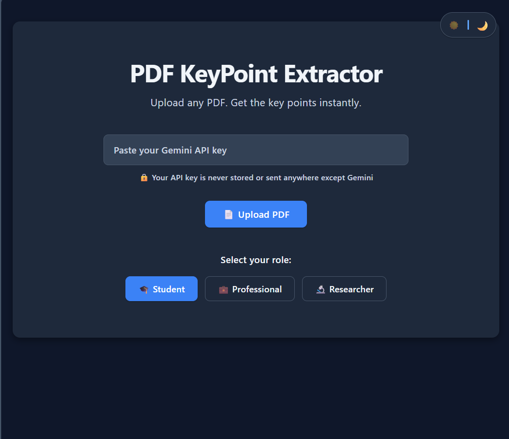
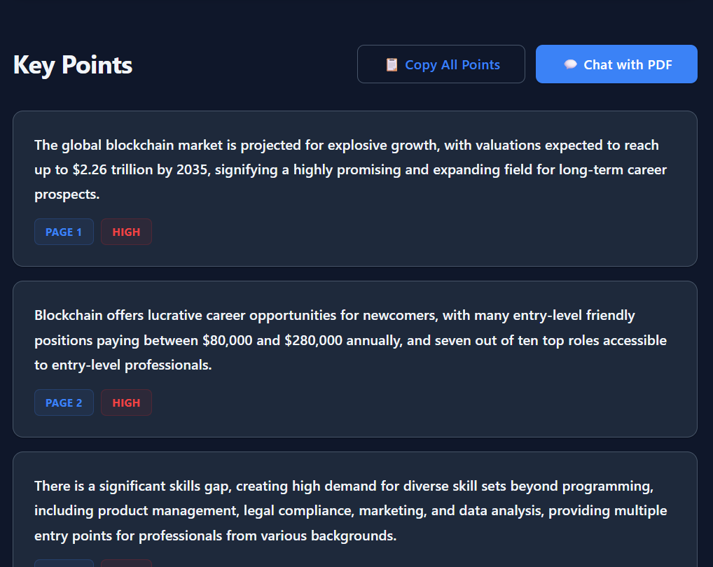

# 📄 PDF KeyPoint Extractor

Upload any PDF and instantly get role-based key points with page numbers powered by AI.

---

## 🎯 Problem Statement

Reading long PDFs is frustrating and time-consuming. Different professionals—students, researchers, and business analysts—need different information from the same document, but existing tools don't provide:

- **Role-based extraction** tailored to your needs
- **Exact page references** so you know where to find information
- **Priority scoring** to identify what matters most

**PDF KeyPoint Extractor** solves this with AI-powered, intelligent document analysis.

---

## ✨ Features

- 🎓 **Role-Based Extraction** - Get key points customized for Student, Professional, or Researcher roles
- 📍 **Page Number References** - Know exactly where each key point appears in the document
- 🎯 **Priority Scoring** - Identify high, medium, and low priority points at a glance
- 💬 **Ask the PDF** - Chat interface to ask questions directly about your document
- 📋 **Copy All Points** - Export all key points to clipboard with one click
- 🚀 **100% Browser-Based** - No backend, no server, no database needed
- 🔒 **Privacy First** - Your API key stays in your browser, never stored or logged

---

## 🛠️ Tech Stack

| Component                    | Technology                    |
|------------------------------|-------------------------------|
| **Frontend**                 | HTML, CSS, Vanilla JavaScript |
| **AI Engine**                | Google Gemini API (Free Tier) |
| **PDF Processing**           | PDF.js (Mozilla)              |
| **Hosting**                  | GitHub Pages (Static)         |
| **Browser APIs**             | Fetch API, Clipboard API      |

---

## 🚀 How to Use

### Step 1: Get Your Gemini API Key
1. Visit [Google AI Studio](https://aistudio.google.com)
2. Sign in with your Google account
3. Click **"Get API Key"** and create a new key
4. Copy the API key

### Step 2: Open the App
Visit: [PDF KeyPoint Extractor Live Demo](https://Deku234.github.io/PDF-Extractor)

### Step 3: Paste API Key
Paste your Gemini API key into the **"Paste your Anthropic API key"** field

### Step 4: Upload PDF
Click **"📄 Upload PDF"** and select any PDF file from your computer

### Step 5: Select Your Role
Choose one:
- 🎓 **Student** - Focused on learning concepts, theory, and educational value
- 💼 **Professional** - Focused on practical applications, actionable insights, and business value
- 🔬 **Researcher** - Focused on citations, methodology, data, and findings

### Step 6: Get Instant Key Points
The AI analyzes your PDF and returns 5-8 key points with:
- 📄 Page number for each point
- 🎯 Priority level (High/Medium/Low)

### Step 7: Ask Questions
Use the **"Ask the PDF"** chat box to ask any question about your document. The AI answers based only on the document content.

---

## 💡 GitHub Copilot Usage

This project was built entirely with GitHub Copilot:

- **Copilot Chat** - Used to generate the three core files (`index.html`, `style.css`, `app.js`)
- **Autocomplete** - Copilot provided intelligent code suggestions for CSS styling and JavaScript logic
- **Debugging** - Copilot helped identify and fix API integration issues
- **API Migration** - Copilot assisted in migrating from Anthropic API to Google Gemini API with minimal changes
- **Function Generation** - Used Copilot to implement `extractTextFromPDF()`, `getKeyPoints()`, and `askQuestion()` functions

---

## 🎬 Live Demo

🔗 **[Open PDF KeyPoint Extractor](https://Deku234.github.io/PDF-Extractor)**

---

## 📸 Screenshots

### Hero Section

### Key Points Display

### Chat Interface

---

## 📝 License

This project is licensed under the **MIT License** - see the [LICENSE](LICENSE) file for details.

---

## 🤝 Contributing

Contributions are welcome! Feel free to:
- Report bugs
- Suggest features
- Submit pull requests

---

## 📧 Contact

For questions or feedback, please open an issue on GitHub.

---

**Made with ❤️ using GitHub Copilot** 
